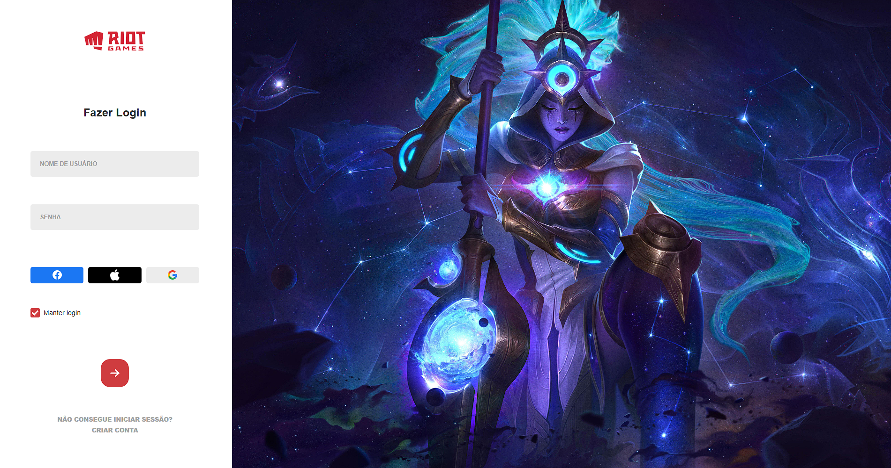

<h1>Tela de login League of Legends</h1>

Veja o resultado final do projeto abaixo. O objetivo foi clonar a tão famosa tela de login o LOLzinho, alinhando as coisas que eu mais gosto de fazer, programar e jogos! O objetivo principal do projeto foi desenvolver a capacidade de desenvolvimento web, voltado principalmente para o front-end.

###

Veja em qualquer dispositivo o resultado final acessando o seguinte link: https://etmjr03.github.io/Clone-TelaDeLoginLOL/

###

  <h3>Linguagens utilizadas JS, HTML e CSS</h3>
  
  
  

###

  <h2>Resultado final do projeto</h2>

  

###

  
Eu e o doguinho agradecemos o seu tempo, fique avontade para dar uma olhadinha nos outros projetos do meu GitHub também, lá você encontra diversas paginas web, sistemas web com back-end em Java e PHP e até aplicativos mobile.

  

###
